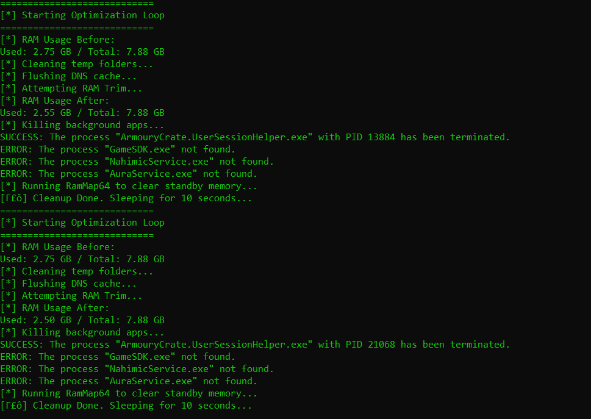

# ⚡ Windows RAM & Performance Optimizer | Clean, Kill, Boost

> ⚠️ **Use at your own risk. For educational purposes only.**

A powerful and lightweight Windows optimization tool for advanced users, gamers, and anyone suffering from lag or memory hogs. This script disables unnecessary services, cleans memory and temp files, and integrates with RAMMap64 to clear standby RAM.

Ideal for **low-end systems**, **older laptops**, or **performance-hungry gaming rigs** like ASUS ROG.

---

## 🔽 Quick Start (Download & Run)

1. 📦 [Download ZIP](https://github.com/PriyomSaha/windows-optimizer-script/archive/refs/heads/main.zip) of this repository.
2. 🗂️ **Extract** the ZIP to a folder (e.g., `Windows-Optimizer`).
3. ▶️ **Right-click** `setup.ps1` and select **Run with PowerShell**.
4. ✅ When prompted with `Execution Policy Change`, choose **Yes to All (A)** to allow the script to run.
5. 🧼 The script will **unblock all files** and start the optimizer silently in the background.

> 🛑 **If PowerShell scripts are restricted**, or you skipped the prompt, run this command once in PowerShell:
>
> ```powershell
> Set-ExecutionPolicy -Scope CurrentUser -ExecutionPolicy RemoteSigned
> ```

---

## 🧰 Features

- ❌ Disables Windows Updates _(optional & reversible)_
- 🛃 Cleans system temp folders
- 📊 Monitors and trims RAM usage in real-time
- ❌ Kills background apps and bloatware
- ♻️ Loops automatically every 10 seconds
- 🚿 Uses [RAMMap64](https://learn.microsoft.com/en-us/sysinternals/downloads/rammap) to clear standby memory
- 🧠 Designed to work with **RAMMap64.exe** and a silent launcher

---

## 📁 Folder Structure

```
.
├── RAMMap/                  # (Optional) Additional RAMMap files
├── clear_ram_loop.bat       # Main optimization script with looping
├── run_invisible.vbs        # VBScript launcher for silent background execution
├── RAMMap64.exe             # Download from Microsoft Sysinternals
├── setup.ps1                # NEW: PowerShell launcher to unblock & run everything
├── README.md
├── LICENSE
├── revert.bat               # (Optional) Undo script for updates
└── screenshots/             # (Optional visuals)
```

---

## ⚙️🧠 Manual Mode (For Geeks & Power Users)

> 💡 Want full control like a true Windows ninja? Follow these steps manually:

1. 💾 **Download [RAMMap64](https://learn.microsoft.com/en-us/sysinternals/downloads/rammap)** (if it's not already included).
2. 🔐 **Right-click** `clear_ram_loop.bat` **or** `run_invisible.vbs` and select **Run as Administrator**.
3. 🛡️ **Optional:** If Windows Defender blocks the files, temporarily **pause real-time protection**:
   - Defender often flags `.bat` or `.vbs` scripts by default — even safe ones like this.
   - These scripts are clean and designed only to **boost performance**.
4. ✅ You're good to go. The optimization loop begins instantly!

🧪 Perfect for **tech-savvy users**, **gamers**, and **DIY tweakers** who want max control.

---

## 🚪 Processes It Kills

- OneDrive.exe
- Teams.exe
- AdobeIPCBroker.exe, AdobeCollabSync.exe
- ArmouryCrate.UserSessionHelper.exe, GameSDK.exe, AuraService.exe, NahimicService.exe
- Suggested Extras for generic laptops:

```batch
taskkill /f /im YourPhone.exe
taskkill /f /im SearchUI.exe
taskkill /f /im Cortana.exe
taskkill /f /im XboxGameBar.exe
taskkill /f /im HPHotkeyMonitor.exe
taskkill /f /im DellSupportAssistRemedation.exe
taskkill /f /im LenovoVantageService.exe
```

---

## ⚠️ Important Notes & Disclaimer

- ❗ Disables Windows Updates and modifies registry entries.
- 🔐 Periodically re-enable updates manually to stay secure.
- 💻 Intended for personal, non-enterprise systems only.
- 👨‍⚖️ Use responsibly on systems you own or have permission to modify.
- ❌ Do not use on school, office, or government devices.

---

## ↩️ Undo / Revert Script

To restore Windows Update manually, run:

```cmd
sc config wuauserv start= auto
sc start wuauserv
```

Or use the included `revert.bat` file (Run as Administrator).

---

## 📆 License

[MIT License](LICENSE)

---

## 🌟 Screenshots

- 

## 💡 Tips

- 🧪 Run once per boot or let it loop in background.
- 🕹️ Perfect for freeing up RAM before gaming.
- 🧩 Customize background apps to kill for your system.

---

## 🌚 Tags

```
batch-script, windows-optimizer, ram-cleaner, rammap, gaming-boost, disable-windows-update, temp-cleaner, bloatware-remover, windows10, windows11, rog-optimizer, sysinternals
```

---

## 👊 Support

Like this tool? Give it a ⭐ and share with friends!

PRs, suggestions, or issues are always welcome. Let’s make Windows faster, together.